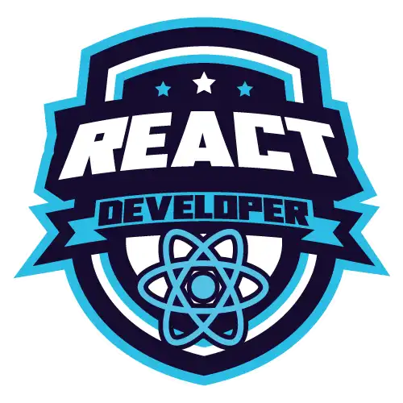

<h1 align="center">
  Formação React Developer
</h1>

<h2 align="center">
  
</h2>

  <a href="#-projeto">🖥️ Projeto</a>&nbsp;&nbsp;&nbsp;|&nbsp;&nbsp;&nbsp;
  <a href="#-tecnologias">🚀 Tecnologias</a>&nbsp;&nbsp;&nbsp;|&nbsp;&nbsp;&nbsp;
  <a href="#-license">📝 License</a>

## 💻 Projeto

Repositório criado para os desafios de códigos da Formação React Developer da DIO.

## 🚀 Tecnologias

Esse projeto foi desenvolvido com as seguintes tecnologias:

- JavaScript

## 📝 License

Esse projeto está sob a licença MIT. Veja o arquivo [LICENSE](LICENSE) para mais detalhes.

---

## 📚 Lista dos Desafios

### Desafio de Código - Formação React Developer

- [Visita na Feira](./Modulo1-Desafio1/script.js)
- [Tartarugas Ninja](./Modulo1-Desafio2/script.js)
- [Arrays Pares](./Modulo1-Desafio3/script.js)
